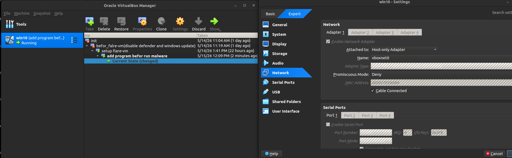
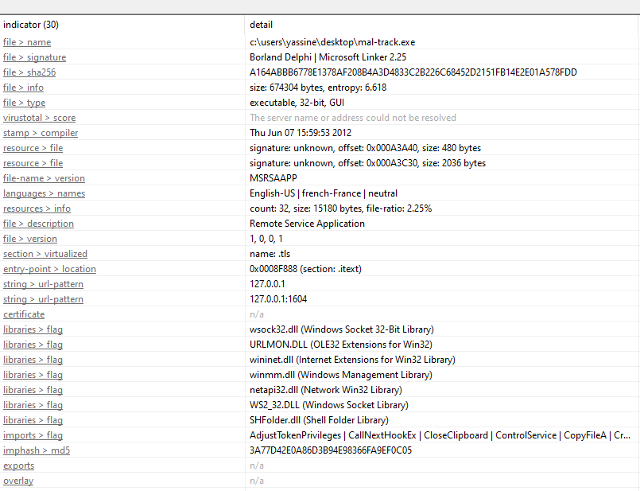
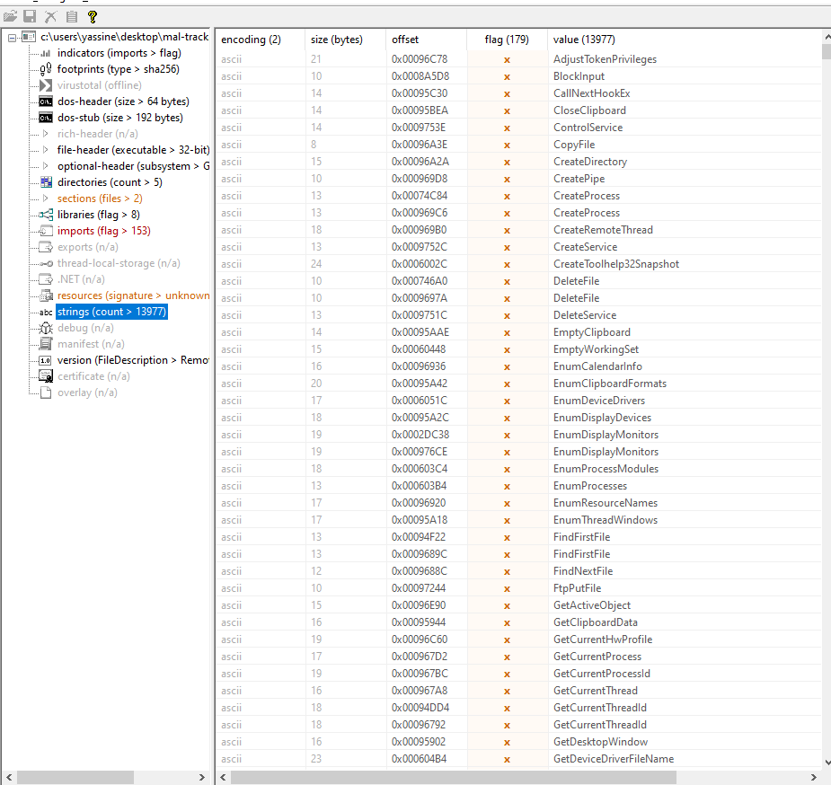
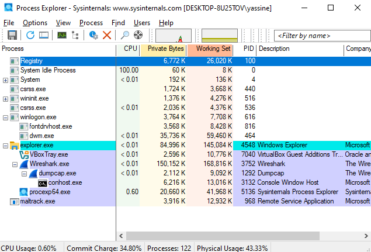
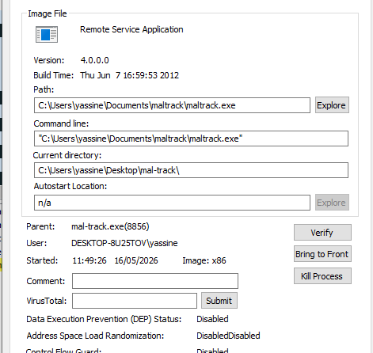
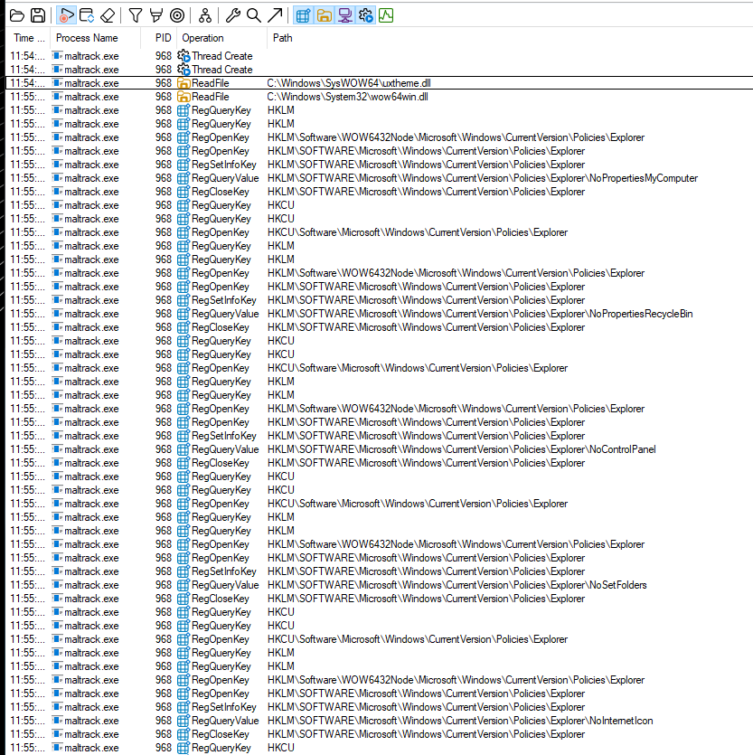
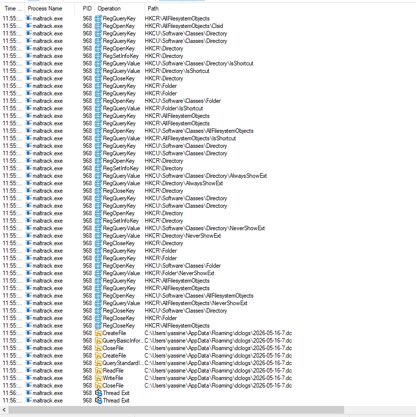
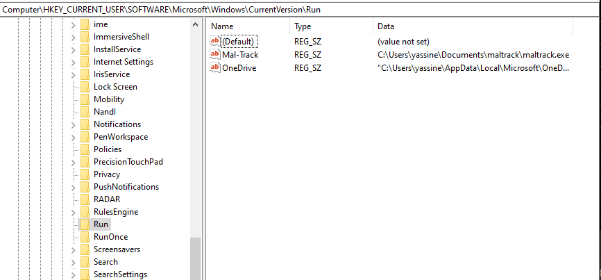

# Malware Analysis and Mitigation Project

## Introduction

This project focuses on analyzing and mitigating a Windows malware sample inside an isolated virtual environment.

The objective is to understand the malware behavior, identify its persistence mechanisms, analyze its communication methods, and develop a program capable of removing it completely from the system.

---

# What is Malware Analysis?

Malware analysis is the process of studying malicious software to understand:

- How it works
- What damage it can cause
- How it persists on the system
- How it communicates with attackers
- How to detect and remove it safely

Malware analysis helps cybersecurity professionals develop detection and mitigation techniques against cyber threats.

---

# Types of Malware Analysis

## Static Analysis

Static analysis is the process of analyzing malware without executing it.

The goal is to extract useful information safely, such as:

- File hashes
- Strings
- Imported libraries
- Suspicious APIs
- Embedded IP addresses or URLs

### Static Analysis Tools Used

| Tool | Purpose |
|---|---|
| PEStudio | Analyze imports and suspicious indicators |
| Detect It Easy | Detect packers and compilers |
| strings | Extract readable strings |
| HashMyFiles | Generate hashes |

---

## Dynamic Analysis

Dynamic analysis involves executing the malware inside an isolated environment to observe its real behavior.

The goal is to identify:

- Process activity
- Registry modifications
- File creation
- Persistence mechanisms
- Network communication

### Dynamic Analysis Tools Used

| Tool | Purpose |
|---|---|
| Process Monitor | Monitor filesystem and registry activity |
| Process Explorer | Analyze running processes |
| Wireshark | Capture network traffic |
| TCPView | View active network connections |
| Regshot | Compare registry changes |

---

# Difference Between Static and Dynamic Analysis

| Static Analysis | Dynamic Analysis |
|---|---|
| No execution required | Malware is executed |
| Safer | Riskier |
| Faster | More detailed |
| Detects embedded artifacts | Detects real behavior |

---

# Analysis Walkthrough

## Step 1 — Environment Preparation

A Windows virtual machine was created using VirtualBox and configured in an isolated environment.

### Screenshot



---

## Step 2 — Initial Static Analysis

The malware sample was analyzed using static analysis tools.

### File Information

| Field | Value |
|---|---|
| File Name | mal-track.exe |
| Original File name |MSRSAAP.EXE |
| MD5 | 3A77D42E0A86D3B94E98366FA9EF0C05 |
| SHA256 | A164ABBB6778E1378AF208B4A3D4833C2B226C68452D2151FB14E2E01A578FDD |
| File Type | executable |
| Architecture | 32-bit |


### Screenshot



---

## Step 3 — Strings Analysis

Readable strings were extracted from the malware sample.

### Suspicious Findings

| Type | Value |
|---|---|
| IP Address | 127.0.0.1 |
| Registry Key | RegSetValueEx |
| Command | cmd.exe |
| URL | 127.0.0.1:1604 |

### Screenshot


---

## Step 4 — Process Monitoring

The malware was executed while monitoring system activity.

### Process

 | 

---
### Operation
 | 


---

## Step 5 — Persistence Analysis

The malware established persistence using:

- Registry Keys

### Registry Keys

```text
\HKEY_CURRENT_USER\SOFTWARE\Microsoft\Windows\CurrentVersion\Run
```

### Screenshot



---


# Malware Removal Program

## Program Functionality

The malware removal program performs the following actions:

- Terminates the malicious process
- Removes persistence mechanisms
- Deletes malware files
- Displays attacker IP information

---

# Proof of Mitigation

The malware was successfully removed from the system.

Verification steps included:

- Confirming the malware process was terminated
- Confirming registry persistence was removed
- Confirming malicious files were deleted
- Confirming network communication stopped


---

# Remediation Recommendations

To prevent similar malware infections:

- Keep systems updated
- Use endpoint protection solutions
- Restrict administrator privileges
- Monitor suspicious network traffic
- Educate users about phishing attacks

---

# Ethical Hacking Report

## Importance of Controlled Environments

Malware should only be executed inside isolated virtual machines to prevent accidental infection or spread.

---

## Ethical and Legal Responsibilities

Malware analysis must only be performed for educational or authorized security purposes.

Unauthorized distribution or execution of malware is illegal and unethical.

---

## Risks of Malware Execution

Executing malware outside isolated environments may result in:

- Data theft
- System compromise
- Network infection
- Unauthorized remote access

---

# Malware Mitigation Report Email

```
To: security@organization.com
Subject: Malware Analysis Report: Mitigation of mal-track

Dear Security Team,

I am writing to report the successful analysis and mitigation of chrome identified during an educational malware analysis exercise. Below are the details:

Summary:
The malware exhibited persistence mechanisms by adding to the Windows startup registry and communicating with a remote server. It was also running a process under the name maltrack.exe.

Proof of Mitigation:
The malware process was successfully terminated, and its persistence mechanisms were removed. Additionally, its file was deleted from the system.

Attacker Information:
The malware communicated with the following IP address: 127.0.0.1

Please feel free to reach out for further clarification or additional details.

Best regards,
Yassine Jaouhary
```

---

# Conclusion

This project provided hands-on experience in malware analysis, persistence detection, network monitoring, and malware mitigation techniques.
